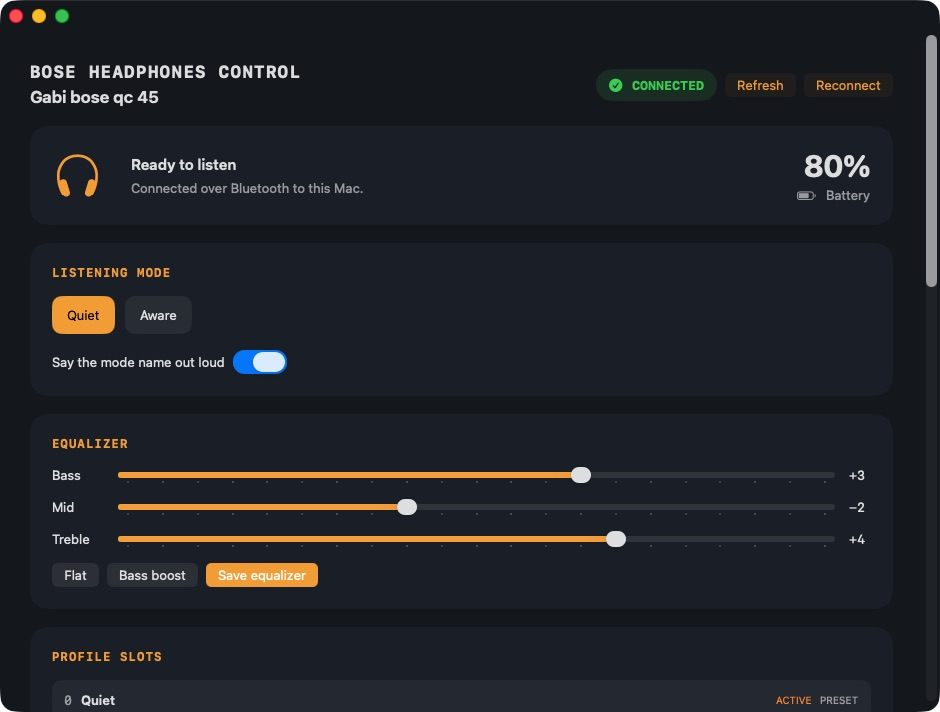
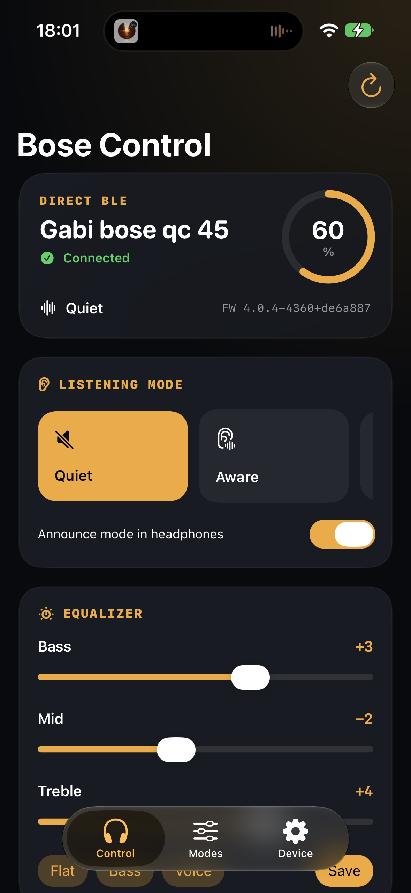
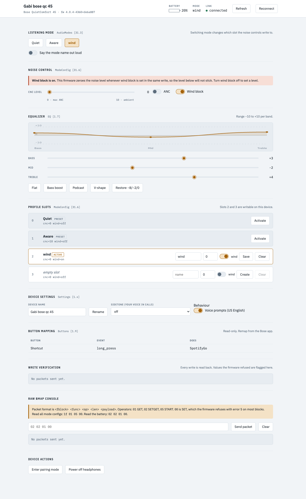
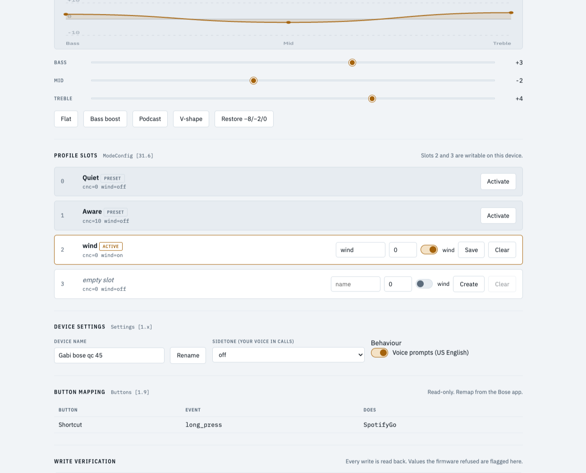

Credit: this project builds on the upstream [bosectl](https://github.com/aaronsb/bosectl) project by Aaron Bockelie and its `pybmap` library, which reverse-engineered Bose's BMAP protocol.

# Bose Headphones Control

[](https://github.com/jpita/bose-headphones-control/actions/workflows/test.yml)
[](https://github.com/jpita/bose-headphones-control/releases/latest)
[](LICENSE)

A simple local control panel for compatible Bose headphones. Change listening modes, noise control, EQ, profiles, voice prompts, sidetone, and other supported settings without a Bose account or cloud service.

## Install on macOS

The native SwiftUI app is the recommended Mac version. It is smaller, faster, and uses native macOS controls. Python and Terminal are not required.

1. [Download the native macOS DMG](https://github.com/jpita/bose-headphones-control/releases/latest/download/Bose-Headphones-Control-Native-0.1.0-arm64.dmg).
2. Open the DMG and drag **Bose Headphones Control** to **Applications**.
3. Control-click the app in Applications and select **Open** the first time.
4. Allow Bluetooth access when macOS asks.
5. Power on and connect your headphones through macOS Bluetooth settings, then open the app.

The current build supports Apple Silicon Macs and is open-source but unsigned. The Control-click step is required because it is not notarized by Apple.



## iPhone app

The native SwiftUI iPhone app connects directly to the encrypted Bose BLE
control service. It uses the audio pairing already stored by iOS, without a
second Bose account or app-pairing flow.



The iPhone source and build instructions are in
[`native-ios/`](native-ios/README.md). A free Apple developer account can install
development builds on a personal device; App Store distribution requires the
paid Apple Developer Program.

## What it can do

- Switch listening modes and optionally announce the selected mode
- Control ANC, ambient level, and wind block on editable profiles
- Tune the three-band equalizer
- Create, edit, activate, and clear supported profile slots
- Rename the headphones and change supported settings such as sidetone and voice prompts
- Show battery, firmware, connection status, and button mapping
- Reconnect after a Bluetooth drop and verify every supported write
- Send raw BMAP packets for protocol work



## Choose how to run it

| Option | Best for | Download or command |
| --- | --- | --- |
| **Swift-only macOS** | Fully native preview with no Python backend | `npm run make:swift-native` |
| **Native iPhone** | Direct encrypted BLE control without Bose Music setup | Build `native-ios/BoseHeadphonesControl.xcodeproj` in Xcode |
| **Native macOS** | Most Mac users | [Download DMG](https://github.com/jpita/bose-headphones-control/releases/latest/download/Bose-Headphones-Control-Native-0.1.0-arm64.dmg) |
| **Electron macOS** | The web interface in a desktop window | [Download DMG](https://github.com/jpita/bose-headphones-control/releases/latest/download/Bose-Headphones-Control-Electron-0.1.0-arm64.dmg) |
| **Web panel** | Development or running directly from source | `.venv/bin/python server.py` |
| **Linux Electron** | Arch Linux or Omarchy on ARM64 | [Download package](https://github.com/jpita/bose-headphones-control/releases/latest/download/bose-headphones-control-0.1.0-aarch64.pacman) |

Release checksums are available in [SHA256SUMS.txt](https://github.com/jpita/bose-headphones-control/releases/latest/download/SHA256SUMS.txt).

The Swift-only preview talks to the headphones directly through a Swift RFCOMM transport. The existing Native, Electron, and web versions remain available and use the Python/RFCOMM backend. Run only one controller at a time.

## Web panel from source

### 1. Get the code

```sh
git clone https://github.com/jpita/bose-headphones-control.git
cd bose-headphones-control
```

### 2. Install the Python environment

Python 3.10 or newer is recommended.

```sh
python3 -m venv .venv
.venv/bin/pip install -r requirements.txt
```

### 3. Connect and start

Pair and connect the headphones through the operating system, then run:

```sh
.venv/bin/python server.py
```

The browser opens at [http://127.0.0.1:8765](http://127.0.0.1:8765). To start without opening a browser:

```sh
.venv/bin/python server.py --no-browser
```

## Electron from source

Complete the web-panel setup first, then install Node.js dependencies and run:

```sh
npm install
npm run desktop
```

Build the macOS Electron DMG and ZIP with:

```sh
.venv/bin/pip install -r requirements-build.txt
npm run make:mac
```

## Native macOS from source

```sh
xcode-select --install
python3 -m venv .venv
.venv/bin/pip install -r requirements-build.txt
./scripts/make-native-mac-dmg.sh
open "release/Bose-Headphones-Control-Native-0.1.0-arm64.dmg"
```

The native app bundles the Python Bluetooth backend; end users do not need Python installed.

## Swift-only native macOS preview

This separate app reuses the native SwiftUI interface but replaces the bundled Python process and localhost API with a Swift `IOBluetooth` RFCOMM backend.

```sh
xcode-select --install
npm run make:swift-native
open "release/Bose-Headphones-Control-Swift-0.1.0-arm64.dmg"
```

The original native app is unchanged and remains available through `npm run make:native`.

## Linux on Arch or Omarchy

For ARM64 Arch systems, download and install the release package:

```sh
curl -LO https://github.com/jpita/bose-headphones-control/releases/latest/download/bose-headphones-control-0.1.0-aarch64.pacman
sudo pacman -U ./bose-headphones-control-0.1.0-aarch64.pacman
```

An [ARM64 AppImage](https://github.com/jpita/bose-headphones-control/releases/latest/download/Bose-Headphones-Control-0.1.0-arm64.AppImage) is also available. It requires `fuse2`:

```sh
sudo pacman -S --needed fuse2
chmod +x Bose-Headphones-Control-0.1.0-arm64.AppImage
./Bose-Headphones-Control-0.1.0-arm64.AppImage
```

Linux needs direct access to a Bluetooth adapter. A virtual machine normally needs a USB Bluetooth adapter passed through to the guest; it cannot use the Mac's existing headphone connection.

## Use the app

1. Confirm the header shows the headphones as **connected**.
2. Choose a listening mode, adjust EQ, or update a supported setting.
3. Check **Write verification** after an edit. The app reads the value back from the headphones.
4. If the status becomes stale after reconnecting Bluetooth, select **Reconnect** in the app.



## Compatibility

The macOS, Electron, web, and Linux apps use BMAP over classic Bluetooth
RFCOMM. The iPhone app uses the same BMAP protocol over Bose's encrypted BLE
service.

| Platform | Status |
| --- | --- |
| macOS on Apple Silicon | Tested with the native, Electron, and Swift-only apps |
| iPhone | Tested on iPhone 15 Pro with iOS 27 using encrypted BLE |
| Linux on ARM64 | Experimental; requires BlueZ and direct Bluetooth access |
| Windows | Not supported |

The app was tested with Bose QuietComfort 45 firmware `4.0.4-4360+de6a887`. Device features and writable settings vary by model and firmware. Unsupported controls are omitted or shown as read-only.

## Privacy and security

- Headphone data stays on the computer.
- The web interface has no remote assets or analytics.
- The HTTP service binds to `127.0.0.1` by default and rejects cross-origin writes.
- Only one backend can control the headphones at a time.

Do not expose the HTTP service to another network interface unless you understand the security implications.

## Tests

```sh
npm test
```

The suite uses fake headphone connections to test recovery, API reads and verified writes, profile safety, request protection, desktop backend shutdown, and Swift BMAP framing. It also checks Electron syntax and both Swift targets. Real Bluetooth transport changes still require a manual headset smoke test.

## Options

| Variable | Default | Purpose |
| --- | --- | --- |
| `BOSE_UI_PORT` | `8765` | Local server port |
| `BOSE_UI_HOST` | `127.0.0.1` | Address to bind |
| `BOSE_MAC` | auto-detect | Headphone Bluetooth address |
| `BOSE_DEVICE` | auto-detect | Device definition, such as `qc45` |

Example:

```sh
BOSE_DEVICE=qc45 BOSE_MAC=68:F2:1F:XX:XX:XX .venv/bin/python server.py
```

## Contributing and security

See [CONTRIBUTING.md](CONTRIBUTING.md) before opening a pull request. Report vulnerabilities privately using the instructions in [SECURITY.md](SECURITY.md). Changes are listed in [CHANGELOG.md](CHANGELOG.md).

## Upstream and license

The BMAP implementation in [`vendor/pybmap`](vendor/pybmap) originates from [aaronsb/bosectl](https://github.com/aaronsb/bosectl). Its MIT license is retained in [vendor/LICENSE-bosectl](vendor/LICENSE-bosectl).

This project is not affiliated with Bose. Released under the [MIT License](LICENSE).
